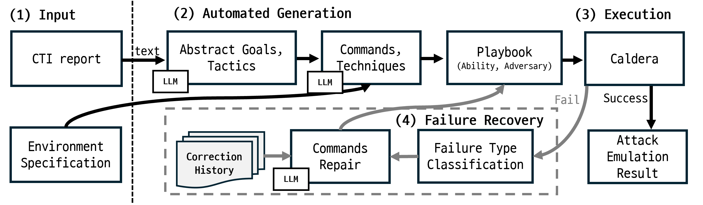

# Automatic End-to-End Adversary Emulation with Self-Correction from Cyber Threat Intelligence Using LLM

<!-- Badges -->
[](https://www.python.org/downloads/release/python-31011/)
[](https://caldera.mitre.org/)
[](LICENSE)
[](https://alpakalee.github.io/caldera-attack-automation)

**Author 1<sup>1</sup> · Author 2<sup>1</sup> · Author 3<sup>1</sup> · Author 4<sup>1,2</sup> · Author 5<sup>2</sup>**
<sup>1</sup>Institution 1 &nbsp; <sup>2</sup>Institution 2

📄 **Paper** · 🌐 **[Project Page](https://alpakalee.github.io/caldera-attack-automation)** · 🎬 **Demo** (coming soon)

---

## Abstract

> *[To be written]*

---

## Key Results

> Experiments: 11 KISA CTI reports × 4 LLMs × 5 runs = 220 total runs.

| Metric | Value |
|--------|-------|
| Average abilities generated per scenario | **27.3** |
| Initial execution success rate | 69.63% |
| Final success rate (after Self-Correcting) | **84.22%** |
| Improvement from Self-Correcting | **+14.59 pp** |
| Average scenario generation time | **2.8 min** |
| Average API cost per scenario (Claude Sonnet 4.5) | **$0.35** |
| ATT&CK Validity | **94.91%** |
| Final attack goals achieved | **11 / 11 (100%)** |

### LLM Comparison

| Model | Avg. Abilities | Initial SR (%) | Final SR (%) | Improvement (pp) | Cost ($) |
|-------|---------------|---------------|-------------|-----------------|---------|
| Claude Sonnet 4.5 | **27.3** | 69.63 | 84.22 | +14.59 | 0.35 |
| GPT-4o | 13.5 | 56.33 | 73.56 | **+17.23** | 0.13 |
| Gemini 2.5 Pro | 13.3 | 71.37 | **87.86** | +16.50 | 0.10 |
| Grok 4 Fast | 17.3 | 58.44 | 73.96 | +15.52 | **0.01** |

---

## System Overview

This system converts KISA CTI PDF reports into executable MITRE Caldera attack scenarios through a **5-step pipeline**:

```
┌─────────────────────────────────────────────────────────────────────┐
│                         Input Layer                                 │
│    CTI Report (PDF)  +  Environment Specification (Markdown)       │
└────────────────────────────┬────────────────────────────────────────┘
                             │
┌────────────────────────────▼────────────────────────────────────────┐
│              LLM-based Scenario Generation                          │
│  Step 1: PDF Text Extraction                                        │
│  Step 2: Abstract Attack Flow  (environment-independent)           │
│  Step 3: Concrete Attack Flow  (environment-specific + MITRE IDs)  │
│  Step 4: Caldera Ability & Adversary Generation                    │
└────────────────────────────┬────────────────────────────────────────┘
                             │
┌────────────────────────────▼────────────────────────────────────────┐
│                   Caldera Execution Layer                           │
│   Upload via REST API  →  Execute Operation  →  Collect Results    │
└────────────────────────────┬────────────────────────────────────────┘
                             │
┌────────────────────────────▼────────────────────────────────────────┐
│               Self-Correction Layer  (Step 5)                       │
│   Failure Classification (5 types) → LLM-based Fix → Retry        │
│   Max 3 retries · VM snapshot restore between attempts             │
└─────────────────────────────────────────────────────────────────────┘
```

<!--  -->

### Failure Classification

The Self-Correcting engine classifies failures into 5 domain-specific types:

| Type | Recoverable | Recovery Strategy |
|------|:-----------:|------------------|
| `syntax_error` | ✅ | LLM fixes PowerShell syntax |
| `timeout` | ✅ | Adjust command timeout/wait logic |
| `dependency_error` | ✅ | Resolve privilege/dependency via LLM |
| `missing_env` | ✅ | Replace with correct env values from spec |
| `unrecoverable` | ❌ | Early exit — no wasted retries |

---

## Comparison with Related Work

| Approach | Executable | Multi-step | Dependency Preserved | Auto-Recovery | CTI-based | Low-cost |
|----------|:---------:|:---------:|:-------------------:|:------------:|:---------:|:-------:|
| Benchmark Datasets | ❌ | ✅ | ✅ | ❌ | ✅ | ✅ |
| Abstract Attack Models | ❌ | ✅ | △ | ❌ | ✅ | ✅ |
| Isolated Execution Tools | ✅ | ❌ | ❌ | ❌ | ❌ | ✅ |
| Orchestration Frameworks | ✅ | ✅ | ❌ | ❌ | ❌ | △ |
| Expert-curated Emulation | ✅ | ✅ | ✅ | ❌ | ✅ | ❌ |
| AURORA | △ | ✅ | ✅ | ❌ | ✅ | △ |
| **Ours** | ✅ | ✅ | ✅ | ✅ | ✅ | ✅ |

---

## Requirements

- Python 3.10.11
- MITRE Caldera 5.3.0 (Ubuntu 20.04 LTS)
- VirtualBox (for VM snapshot management via SSH)
- At least one LLM API key: Anthropic / OpenAI / Google / xAI

### Test Environment

| Component | Specification |
|-----------|--------------|
| Caldera Server | Ubuntu 20.04 LTS, Caldera 5.3.0 |
| Target PC1 | Windows 10 Pro 1803 (primary target) |
| Target PC2 | Windows 10 (lateral movement pivot) |
| Target PC3 | Windows Server 2019 (Active Directory) |
| Primary LLM | Claude Sonnet 4.5 |

---

## Installation

```bash
git clone https://github.com/alpakalee/caldera-attack-automation.git
cd caldera-attack-automation
pip install -r requirements.txt
cp .env.example .env
# Edit .env with your API keys and environment configuration
```

---

## Configuration

Edit `.env` with the following settings:

### LLM API Keys
```env
ANTHROPIC_API_KEY=your_key_here   # For Claude
OPENAI_API_KEY=your_key_here      # For GPT-4o
GOOGLE_API_KEY=your_key_here      # For Gemini
XAI_API_KEY=your_key_here         # For Grok

LLM_PROVIDER=claude               # claude | openai | gemini | grok
```

### Caldera Server
```env
CALDERA_URL=http://your-caldera-server:8888
CALDERA_API_KEY=your_caldera_api_key
```

### VM Configuration (required for Step 5)
```env
VM_HOST=your_virtualbox_host_ip
VM_SSH_USER=your_ssh_user
VM_SSH_PASSWORD=your_password
VM_NAME=your_vm_name
VM_SNAPSHOT=clean_snapshot_name
```

See `.env.example` for all options and `run_config_details.md` for per-scenario settings.

---

## Usage

### Full Pipeline (Steps 1–5)

```bash
python main.py \
  --step 1-5 \
  --pdf data/raw/KISA_TTPs_1.pdf \
  --env environment_ttps1.md
```

### Run Specific Steps

```bash
# Scenario generation only (no execution)
python main.py --step 1-4 --pdf data/raw/KISA_TTPs_1.pdf --env environment_ttps1.md

# Resume from step 3
python main.py --step 3-5 --pdf data/raw/KISA_TTPs_1.pdf --env environment_ttps1.md
```

### Batch Automation (All 11 Scenarios)

```bash
python auto_run.py
```

### CLI Arguments

| Argument | Description | Default |
|----------|-------------|---------|
| `--step` | Steps to run (`1`, `1-5`, `3-5`, etc.) | `1-5` |
| `--pdf` | Path to KISA CTI PDF report | required |
| `--env` | Path to environment specification `.md` file | required |
| `--version-id` | Custom version ID for output directory | timestamp |
| `--llm` | LLM provider (`claude` / `openai` / `gemini` / `grok`) | from `.env` |

---

## Pipeline Steps

| Step | Module | Description | Output |
|------|--------|-------------|--------|
| 1 | `step1_pdf_processing.py` | Extract text from CTI PDF | `step1_pdf.yaml` |
| 2 | `step2_abstract_flow.py` | Generate environment-independent attack flow | `step2_abstract.yaml` |
| 3 | `step3_concrete_flow.py` | Apply environment info + validate MITRE Technique IDs | `step3_concrete.yaml` |
| 4 | `step4_ability_generator.py` | Generate Caldera Abilities & Adversary profile | `abilities.yml`, `adversaries.yml` |
| 5 | `step5_self_correcting.py` | Upload, execute, classify failures, auto-fix, retry | `operation_report.json`, `correction_report.json` |

All outputs are saved to:
```
data/processed/{pdf_name}/{version_id}/
```

---

## Dataset

11 KISA CTI reports (2020–2024), covering ransomware, APT, watering hole, AD attacks, and more:

| ID | Title | Attack Type | Complexity |
|----|-------|-------------|-----------|
| TTPs#1 | Homepage-based Internal Network Compromise | Web exploit + lateral movement | Advanced |
| TTPs#2 | Spear Phishing Information Collection Campaign | Social engineering | Expert |
| TTPs#3 | Malware-based Multi-stage Intrusion | Malware-centric | Advanced |
| TTPs#4 | Phishing Target Reconnaissance | Reconnaissance | Advanced |
| TTPs#5 | AD Environment Attack Patterns | Directory service attack | Expert |
| TTPs#6 | Targeted Watering Hole Attack | Website compromise | Medium |
| TTPs#7 | SMB Admin Share Lateral Movement | Lateral movement | Advanced |
| TTPs#8 | Operation GWISIN – Targeted Ransomware | Ransomware | Expert |
| TTPs#9 | Personal Surveillance Attack Strategy | Spyware | Medium |
| TTPs#10 | Operation GoldGoblin – Zero-day Intrusion | Zero-day + APT | Expert |
| TTPs#11 | Operation An Octopus – Management Solution Attack | Supply chain | Expert |

---

## Project Structure

```
caldera-attack-automation/
├── main.py                       # Main CLI entry point
├── auto_run.py                   # Batch automation (all 11 scenarios)
├── requirements.txt
├── .env.example                  # Environment config template
├── run_config_details.md         # Per-scenario execution guide
├── environment_ttps{1-11}.md     # Per-scenario environment specs
│
├── modules/
│   ├── ai/                       # LLM client implementations
│   │   ├── base.py               #   Abstract base class
│   │   ├── claude.py             #   Anthropic Claude
│   │   ├── chatgpt.py            #   OpenAI GPT
│   │   ├── gemini.py             #   Google Gemini
│   │   ├── grok.py               #   xAI Grok
│   │   └── factory.py            #   Factory pattern
│   ├── caldera/                  # Caldera REST API integration
│   │   ├── uploader.py
│   │   ├── executor.py
│   │   ├── reporter.py
│   │   ├── agent_manager.py
│   │   └── deleter.py
│   ├── steps/                    # Pipeline step implementations
│   │   ├── step1_pdf_processing.py
│   │   ├── step2_abstract_flow.py
│   │   ├── step3_concrete_flow.py
│   │   ├── step4_ability_generator.py
│   │   └── step5_self_correcting.py
│   ├── prompts/                  # LLM prompt templates (YAML)
│   │   ├── manager.py
│   │   └── templates/
│   └── core/                     # Shared utilities
│       ├── config.py
│       ├── models.py
│       └── metrics.py
│
├── data/
│   ├── raw/                      # Input KISA PDFs (11 files)
│   ├── mitre/                    # MITRE ATT&CK JSON (v15.1, v16, v18)
│   ├── mapping_table/            # TTP mappings & ground truth
│   └── processed/                # Experiment outputs (timestamped)
│
├── config/
│   └── classification_rules.yml  # Failure type classification rules
│
├── scripts/                      # Utility scripts
│   ├── analyze_metrics.py
│   ├── analyze_report.py
│   ├── vm_reload.py
│   └── ...
│
└── docs/                         # GitHub Pages (Just the Docs)
```

---

## Demo

> 🎬 Demo video coming soon.

<!-- Uncomment when available:
[](https://youtu.be/your-video-id)
-->

---

---

## License

This project is licensed under the MIT License — see [LICENSE](LICENSE) for details.

---

## Acknowledgments

- [MITRE Caldera](https://caldera.mitre.org/) for the adversary emulation platform
- [KISA](https://www.kisa.or.kr/) for the CTI report dataset
- [MITRE ATT&CK](https://attack.mitre.org/) for the threat knowledge base
