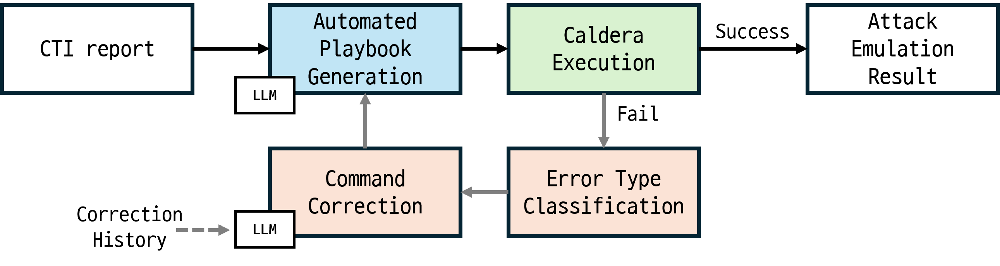
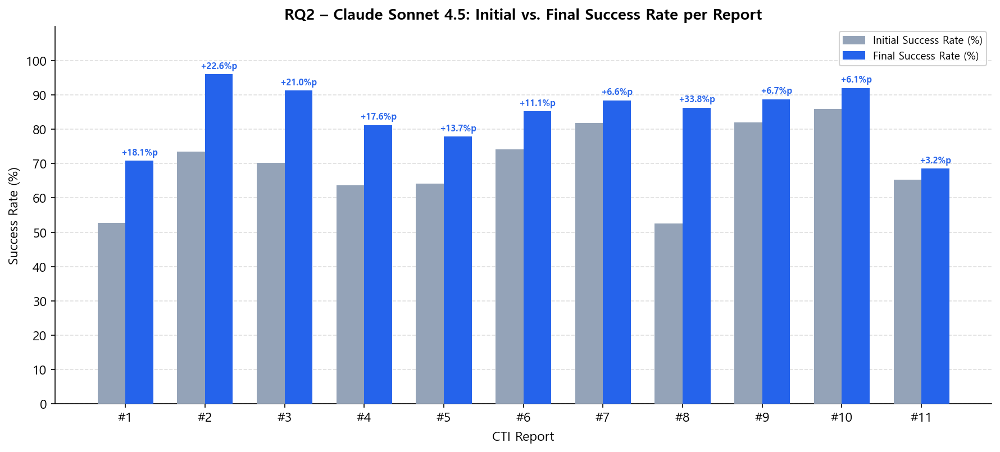

<div style="text-align: center; padding: 2em 0 1em;">

<h1 style="font-size: 1.6em; line-height: 1.4; font-weight: bold;">
Automatic End-to-End Adversary Emulation with<br>
Self-Correction from Cyber Threat Intelligence Using LLM
</h1>

<p style="margin: 1.2em 0 0.4em; font-size: 1.05em;">
  <a href="#">Author 1</a><sup>1</sup>&nbsp;&nbsp;
  <a href="#">Author 2</a><sup>1</sup>&nbsp;&nbsp;
  <a href="#">Author 3</a><sup>1</sup>&nbsp;&nbsp;
  <a href="#">Author 4</a><sup>1,2</sup>&nbsp;&nbsp;
  <a href="#">Author 5</a><sup>2</sup>
</p>

<p style="margin: 0.2em 0 1.2em; color: #555; font-size: 0.95em;">
  <sup>1</sup> Institution 1 &nbsp;&nbsp;
  <sup>2</sup> Institution 2
</p>

<p>
  <a href="https://github.com/alpakalee/testcaldera" style="display: inline-block; margin: 0 0.3em; padding: 0.45em 1.1em; background: #24292e; color: white; border-radius: 5px; text-decoration: none; font-size: 0.95em;">💻 Code</a>
  <a href="#demo" style="display: inline-block; margin: 0 0.3em; padding: 0.45em 1.1em; background: #c0392b; color: white; border-radius: 5px; text-decoration: none; font-size: 0.95em;">🎬 Demo</a>
</p>

</div>

---

## Abstract

> *To be written.*

---

## System Overview



We propose an **end-to-end automated pipeline** that converts Cyber Threat Intelligence (CTI) PDF reports into executable MITRE Caldera adversary emulation scenarios using large language models — with no human intervention after initial environment setup.

The system consists of four functional layers:


### Comparison with Prior Work

Our system is the only approach that satisfies all six requirements simultaneously:

| Approach | Executable | Multi-step | Dependency | Auto-Recovery | CTI-based | Low-cost |
|----------|:---------:|:---------:|:----------:|:------------:|:---------:|:-------:|
| Benchmark Datasets | ✗ | ✓ | ✓ | ✗ | ✓ | ✓ |
| Abstract Attack Models | ✗ | ✓ | △ | ✗ | ✓ | ✓ |
| Isolated Execution Tools | ✓ | ✗ | ✗ | ✗ | ✗ | ✓ |
| Orchestration Frameworks | ✓ | ✓ | ✗ | ✗ | ✗ | △ |
| Expert-curated Emulation | ✓ | ✓ | ✓ | ✗ | ✓ | ✗ |
| AURORA | △ | ✓ | ✓ | ✗ | ✓ | △ |
| **Ours** | **✓** | **✓** | **✓** | **✓** | **✓** | **✓** |

---

## Key Results

Experiments conducted on **11 KISA CTI reports × 4 LLMs × 5 runs = 220 total experiments**.

### RQ1 — Efficiency (Claude Sonnet 4.5)

| Metric | Value |
|--------|-------|
| Average abilities generated per scenario | **27.3** |
| Average scenario generation time | **2.8 min** |
| Average API cost per scenario | **$0.35** |

### RQ2 — Execution Success Rate & Self-Correction Effect

| Metric | Value |
|--------|-------|
| Initial execution success rate | 69.63% |
| Final success rate (after Self-Correction) | **84.22%** |
| Improvement | **+14.59 pp** |
| `missing_env` failure recovery rate | 61.29% |



**Self-Correction improvement across all LLMs:**

| Model | Initial SR | Final SR | Improvement |
|-------|-----------|---------|------------|
| Claude Sonnet 4.5 | 69.63% | 84.22% | **+14.59 pp** |
| GPT-4o | 56.33% | 73.56% | **+17.23 pp** |
| Gemini 2.5 Pro | 71.37% | 87.86% | **+16.50 pp** |
| Grok 4 Fast | 58.44% | 73.96% | **+15.52 pp** |

### RQ3 — ATT&CK Fidelity

| Metric | Value |
|--------|-------|
| ATT&CK Validity (valid MITRE Technique ID ratio) | **94.91%** |
| CTI Precision | 73.97% |
| CTI Recall | 52.56% |
| CTI F1-score | **61.45%** |

### RQ4 — Security & Final Attack Goal Achievement

| Metric | Value |
|--------|-------|
| KISA security checklist pass rate (avg.) | 91.11% |
| Final attack goals achieved | **11 / 11 (100%)** |

### Comparison with AURORA (8 shared CTI reports)

| Metric | AURORA | Ours |
|--------|--------|------|
| Avg. chain length | 23.87 | **28.75** |
| Execution success rate | 59.96% | **68.86%** |
| CTI Recall | 24.26% | **34.57%** |
| CTI F1-score | 27.73% | **32.90%** |

---

<a name="demo"></a>
## Demo

> 🎬 Demo video coming soon.

<!-- When available, embed video here:
<div style="text-align:center; margin: 1em 0;">
<iframe width="700" height="394"
  src="https://www.youtube.com/embed/VIDEO_ID"
  frameborder="0" allowfullscreen>
</iframe>
</div>
-->

---

## Getting Started

**Requirements**: Python 3.10.11 · MITRE Caldera 5.3.0 · VirtualBox · LLM API key (Anthropic / OpenAI / Google / xAI)

```bash
git clone https://github.com/alpakalee/testcaldera.git
cd testcaldera
pip install -r requirements.txt
cp .env.example .env   # fill in API keys and VM config
```

**Run the full pipeline on a single scenario:**

```bash
python main.py \
  --step 1-5 \
  --pdf data/raw/KISA_TTPs_1.pdf \
  --env environment_ttps1.md
```

**Run all 11 scenarios automatically:**

```bash
python auto_run.py
```

For detailed setup instructions, see the [Installation Guide](pages/installation) and [Configuration](pages/configuration).

---

## Dataset

We evaluate on all **11 KISA CTI reports** (2020–2024), covering ransomware, APT, watering hole, Active Directory attacks, and more.

| ID | Title | Complexity |
|----|-------|-----------|
| TTPs#1 | Homepage-based Internal Network Compromise | Advanced |
| TTPs#2 | Spear Phishing Information Collection Campaign | Expert |
| TTPs#3 | Malware-based Multi-stage Intrusion | Advanced |
| TTPs#4 | Phishing Target Reconnaissance | Advanced |
| TTPs#5 | AD Environment Attack Patterns | Expert |
| TTPs#6 | Targeted Watering Hole Attack | Medium |
| TTPs#7 | SMB Admin Share Lateral Movement | Advanced |
| TTPs#8 | Operation GWISIN – Targeted Ransomware | Expert |
| TTPs#9 | Personal Surveillance Attack Strategy | Medium |
| TTPs#10 | Operation GoldGoblin – Zero-day Intrusion | Expert |
| TTPs#11 | Operation An Octopus – Management Solution Attack | Expert |

---

<div style="text-align: center; color: #888; font-size: 0.85em; margin-top: 2em;">
This project is licensed under the <a href="https://github.com/alpakalee/testcaldera/blob/main/LICENSE">MIT License</a>.
For educational and authorized security research purposes only.
</div>
